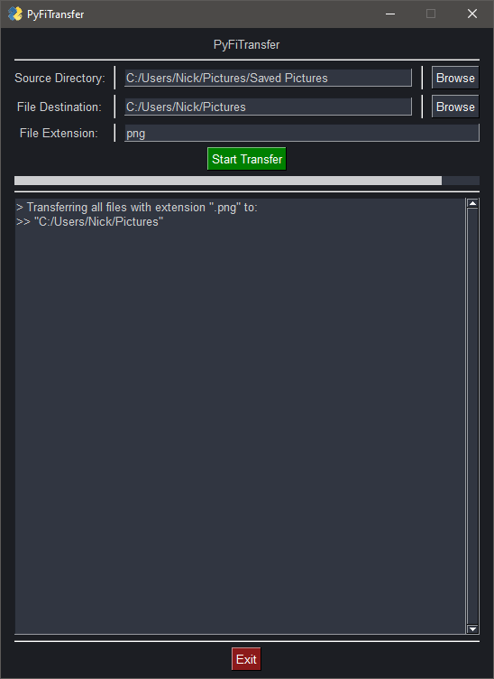

# PyFiTransfer

## About

- **_PyFiTransfer_** is a program built to transfer files of a given extension-type from their source directory to a destination directory.

- There are two different program versions: a _CLI_ version **and** a _GUI_ version.

- Not meant to be used directly within a Python environment, but rather as a standalone CLI/GUI application.

---

## Installing PyFiTransfer

### **Using pip _(Recommended)_**

- To install _**PyFiTransfer**_ using `pip`, enter the following command within the terminal:

  - ```shell
      python -m pip install PyFiTransfer
    ```

- Done!

---

### **Manual Installation**

1. Start by doing **_one of two things_**:

   - **Either:**

     - **A.** Download source code `*.zip` archive from the PyFiTransfer GitHub repo ["releases"](https://github.com/schlopp96/PyFiTransfer/releases/latest) tab, and extract the contents to your desired installation directory.

   - **Or:**

     - **B.** Clone the repo with the git client of your choice by entering the following command:

       - ```shell
         git clone https://github.com/schlopp96/PyFiTransfer/releases/latest/
         ```

2. Navigate to directory containing extracted contents, and open said directory within a terminal.

3. Install all dependencies for this package by entering the following command:

   - ```shell
     pip install -r requirements.txt
     ```

- Done!

---

## **Using PyFiTransfer**

### **PyFiTransfer GUI**

- _If you **HAVE** installed **`PyFiTransfer`** via pip, you can launch the PyFiTransfer GUI by entering the following command:_

  ```shell
  pyfitransfer-gui
  ```

- _If you **HAVE NOT** installed **`PyFiTransfer`** using `pip`:_

  - Open the python script titled `main.py` located within the installation directory:
    - `"~/PyFiTransfer/main.py"`

1. To select the source directory containing the files you wish to transfer, click the "Browse" button located in the top row.

2. To select the destination directory you wish to transfer the files to, click the "Browse" button located in the middle row.

3. Fill out the "file type" input field in the third row to choose what file-type to transfer

4. Click the `"Start Transfer"` button.

   - The transfer will begin, and the progress will be displayed in the log output box.



---

### **PyFiTransfer CLI**

- _If you **HAVE** installed **`PyFiTransfer`** via pip, you can launch the PyFiTransfer CLI by entering the following command:_

  ```shell
  pyfitransfer-cli
  ```

- _If you **HAVE NOT** installed **`PyFiTransfer`** using `pip`:_

  - Open the python script titled `CLI_main.py` located within the installation directory:
    - `"~/PyFiTransfer/CLI_main.py"`

1. Enter the file-path to the directory acting as the file transfer's destination.

2. Enter the file-type of the files you wish to transfer **_(not including the "." that proceeds the file type)_**.

   - Example:
     - You would enter (without the quotations) `"exe"` when needing to migrate files with the `".exe"` extension.

3. If everything is correctly validated, a success message is returned to the console, alongside a list of files that were successfully transferred.

   - If an error occurs, the program will display an error message before exiting.

4. Finally, the user is prompted to press the `[ENTER]` key to exit the process.


---

## Contact

- If you have any questions, comments, or concerns that cannot be alleviated through the [project's GitHub repository](https://github.com/schlopp96/PyFiTransfer), please feel free to contact me through my email address:

  - `schloppdaddy@gmail.com`

---
